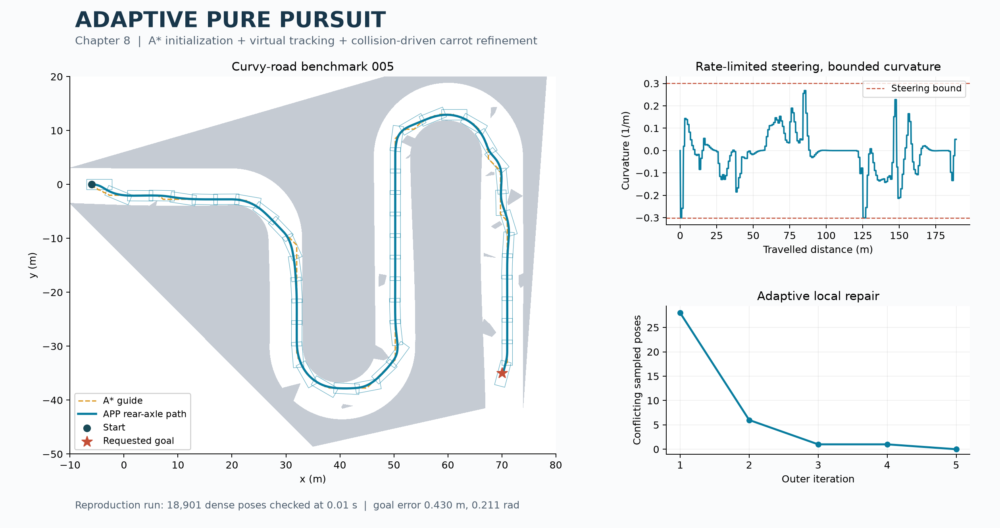
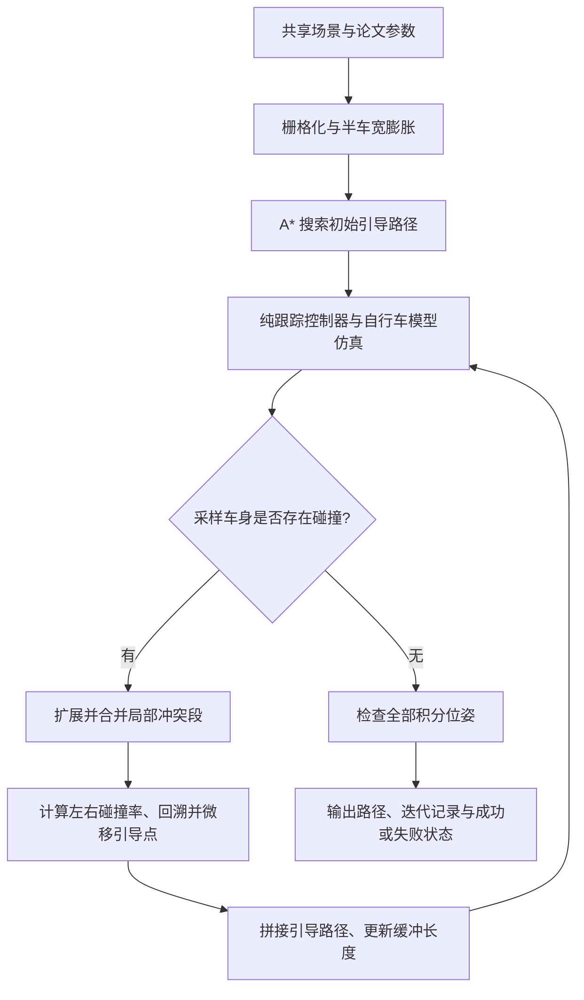

# APP · 第八章配套代码

**自适应纯跟踪路径规划 / Adaptive Pure Pursuit**

本仓库配套中文图书 **《非结构化场景自动驾驶轨迹规划技术》** 第八章《露天矿区狭窄大曲率道路场景中的轨迹规划方法》，提供 **MATLAB 和 C++** 两个版本。

书名英文译名为 *Trajectory Planning Techniques for Autonomous Driving in Unstructured Environments*；图书本身为中文版，英文名称用于方便国际读者理解。

建议结合本章与下列论文阅读代码。两种语言采用相同的 APP 流程、车辆模型、参数与场景输入，技术细节以论文为依据。

> Bai Li, Yazhou Wang, Siji Ma, Xuepeng Bian, Hu Li, Tantan Zhang, Xiaohui Li, and Youmin Zhang. **Adaptive Pure Pursuit: A Real-Time Path Planner Using Tracking Controllers to Plan Safe and Kinematically Feasible Paths.** *IEEE Transactions on Intelligent Vehicles*, **8**(9): 4155–4168, **2023**. [DOI: 10.1109/TIV.2023.3296435](https://doi.org/10.1109/TIV.2023.3296435).

**使用本代码进行研究、实验或发表成果时，请引用该论文。** BibTeX 见 [CITATION.bib](CITATION.bib)，也可使用 GitHub 侧栏的 **Cite this repository** 获取引用信息。

| 版本 | 实现方式 | 运行入口 |
| --- | --- | --- |
| [MATLAB](matlab/) | 原生 MATLAB 实现 A*、纯跟踪仿真、碰撞检测与局部路径调整 | `run_demo`；`plot_demo` 绘图 |
| [C++](cpp/) | C++17 独立实现同一算法，使用相同的文本场景与参数 | 编译后运行 `app_demo` |

两个版本均从场景输入开始重新规划。MATLAB 无需额外工具箱，C++ 计算不调用 MATLAB；APP 主体无需安装数值优化求解器。

## 实际运行效果

默认示例为原始 MATLAB 实验集合中的 **第 005 号狭窄弯曲道路场景**。下图由本仓库实际运行结果生成，展示 A* 初始引导路径、APP 路径与车辆足迹、曲率变化及碰撞消除过程。



左图中，橙色虚线为 A* 初始引导路径，蓝色实线为 APP 生成的后轴中心路径，浅蓝色矩形为车辆足迹。右上图给出路径曲率与转角对应的曲率上限；右下图展示各轮外层迭代的冲突采样点数量。

本例经过 **5 轮外层迭代**，冲突采样点依次为 **28、6、1、1、0**，路径长度为 **189.0 m**。以 `0.01 s` 间隔对全部 **18,901 个积分位姿**进行独立车身碰撞检查，未发现碰撞。终点位置、航向误差分别约为 `0.430 m`、`0.211 rad`。详细数值见 [验证记录](docs/VALIDATION.md)。

该图展示随附场景上的运行效果；论文中的完整对比实验、统计结果与实车实验请参阅原文。

## 与第八章及论文的对应

APP 的核心是**利用跟踪控制器生成满足运动学约束的路径，再根据碰撞反馈调整被跟踪的引导路径**。纯跟踪控制器在引导路径上选择前视点（carrot point），驱动虚拟车辆前进；发生碰撞时，算法局部移动引导点，再重新跟踪，逐步消除车身与障碍物的冲突。

| 论文内容 | 本仓库实现 |
| --- | --- |
| Algorithm 1、III-B 节：初始化与外层循环 | 按半车宽膨胀栅格地图，使用 **A\*** 搜索初始引导路径，随后迭代跟踪与修正 |
| 式 (2)、(3)、(5)、(A4)：车辆模型与纯跟踪 | 以恒定虚拟车速积分自行车模型，同时约束前轮转角及转角速率 |
| 式 (6)、(7)：局部冲突段 | 按路径累计长度扩展碰撞段，并合并相接的区间 |
| 式 (8)：左右碰撞率 | 分别计算左右半车身与障碍物的重叠面积，分母为**半车身面积** |
| 式 (9)、(10)、Algorithm 2：局部调整 | 沿引导路径累计长度回溯，选择对应引导点，向碰撞较轻的一侧微移 |
| Algorithm 3：拼接与更新 | 将局部调整合入全局引导路径，重新进行完整跟踪仿真 |

车辆位置统一取**后轴中心**，长度单位为米，角度单位为弧度。转角状态在积分步、控制周期和局部仿真之间连续传递。两版初始化均使用 A*；这一位置已按本章与论文要求统一，不使用 DP。

本仓库实现本章的 APP 路径规划部分，采用论文的恒定虚拟车速。书中后续独立速度规划不包含在此示例中。公式到函数的逐项对应、几何计算及数值离散说明见 [docs/ALGORITHM.md](docs/ALGORITHM.md)。

## 总体架构



达到迭代上限或出现搜索、跟踪失败时，程序明确报告失败；达到上限不作为收敛条件。最终积分位姿检查是本实现增加的结果核验步骤，可能拒绝仅在控制采样点上无碰撞的候选路径。

## 论文参数

两种语言共用 [data/paper_parameters.txt](data/paper_parameters.txt)。下列数值对应论文表 I。

| 参数 | 默认值 |
| --- | --- |
| 轴距、车长、车宽、后悬 | 2.8、4.689、1.942、0.929 m |
| 前轮转角、转角速率上限（绝对值） | 0.7 rad、2.5 rad/s |
| 虚拟车速、控制采样间隔 | 1.0 m/s、1.0 s |
| 外层、局部内层迭代次数上限 | 10、200 |
| 冲突段两侧初始缓冲长度 | 4 m、4 m |
| 每轮缓冲长度增量 | 每侧 5 m |
| 最大回溯长度 | 4 m |
| 引导点单次微移距离 | 0.1 m |

论文表 I 未规定的数值设置在参数文件后半部分单独列出：栅格分辨率 `0.25 m`、引导路径采样间距 `0.1 m`、前视距离 `3 m`、每个控制周期 `100` 个积分子步、终端引导线延长 `7 m`。两个版本使用相同设置。

## 安装与运行

先下载或克隆整个仓库，以下命令均从仓库根目录执行：

```bash
git clone https://github.com/libai1943/Adaptive_Pure_Pursuit_Planner.git
cd Adaptive_Pure_Pursuit_Planner
```

### MATLAB

已在 **MATLAB R2021b** 验证，无需额外工具箱。在 MATLAB 中将当前文件夹切换到仓库根目录，执行：

```matlab
addpath('matlab');
result = run_demo();
assert(result.success);
plot_demo(result);
```

默认读取 `data/benchmark_005.txt`，结果保存在工作区 `result` 和 `output/matlab/`。`plot_demo` 使用 MATLAB 原生绘图，显示路径、车辆足迹和曲率。

更换场景时，向 `run_demo(sceneFile, outputDirectory)` 传入场景文件及输出目录；绘图时使用 `plot_demo(result, sceneFile)`，确保计算与绘图读取同一场景。自定义场景格式及原始 MAT 数据转换方式见 [data/README.md](data/README.md)。

### C++

需要 **C++17 编译器**及 **CMake 3.16 或更高版本**，规划程序仅依赖 C++ 标准库。

```bash
cmake -S . -B build -DCMAKE_BUILD_TYPE=Release
cmake --build build --config Release
```

Linux 或采用单配置生成器时，运行：

```bash
./build/app_demo data/benchmark_005.txt data/paper_parameters.txt output/cpp
```

Windows 使用 Visual Studio 生成器时，运行：

```powershell
.\build\Release\app_demo.exe data/benchmark_005.txt data/paper_parameters.txt output/cpp
```

如果所用 MinGW 工具链不支持中文路径，请将仓库放在纯英文路径下编译。命令行返回值为 `0` 表示规划成功，`1` 表示规划失败，`2` 表示输入或执行错误。

### 生成 README 效果图

完成 C++ 运行后，可用 Python 绘制上方的三联图。Python 仅用于读取和展示结果：

```bash
python -m pip install numpy matplotlib
python tools/plot_result.py data/benchmark_005.txt output/cpp docs/images/app_benchmark.png
```

也可将 `output/cpp` 替换为 `output/matlab`，从 MATLAB 导出的相同格式数据绘图。

## 两种语言的一致性

C++ 与 MATLAB 分别完成 A* 搜索、跟踪仿真和全部 APP 迭代。随附的 4 个场景用于检查两版在成功、迭代上限及密集位姿碰撞等情况下的行为。

本次 Windows 验证中，两版的 A* 引导路径、迭代记录与最终状态一致，导出状态及引导点坐标的最大绝对差异小于 **2.4 × 10⁻¹³**；自动比较容差设为 `1e-9`。测试环境与逐场景结果见 [docs/VALIDATION.md](docs/VALIDATION.md)。

完成上述两版默认示例后，使用 Python 3 执行比较，无需额外 Python 包：

```bash
python tools/compare_results.py output/cpp output/matlab
```

APP 面向已知静态障碍物下的前进行驶，不保证精确满足终端位姿，也不保证在所有可行场景中收敛。程序通过 `summary.json` 报告成功标志、失败原因和终点误差。积分位姿检查属于离散验证；完整的实验范围与方法性质以论文为准。

## 主要文件与结果

| 文件或目录 | 作用 |
| --- | --- |
| `matlab/run_demo.m`、`matlab/plot_demo.m` | MATLAB 运行与绘图入口 |
| `matlab/app_plan.m` | APP 外层循环、局部修正与拼接 |
| `matlab/app_astar.m`、`matlab/app_sample.m` | A* 初始化与纯跟踪仿真 |
| `matlab/app_geometry.m`、`matlab/app_segments.m` | 车身碰撞、半车身重叠率与冲突段划分 |
| `cpp/app.hpp`、`cpp/app.cpp` | C++ 数据结构与同一 APP 算法；库入口为 `app::plan` |
| `cpp/main.cpp` | C++ 命令行入口、场景读取与结果保存 |
| `data/` | 共享车辆参数及 4 个文本格式场景 |
| `tools/compare_results.py`、`tools/run_regression.py` | 双语言结果比较与四场景回归检查 |
| `tools/plot_result.py`、`tools/validate_result.py` | 结果绘图与独立几何核验 |
| `docs/` | 公式对应、验证记录与实际运行效果图 |

两个版本均输出 `initial_route.csv`（A* 引导路径）、`path.csv`（控制采样点及对应引导点）、`dense_path.csv`（全部积分位姿）、`history.csv`（逐轮冲突记录）和 `summary.json`（运行状态与终点误差）。运行结果写入各自的 `output/` 子目录，不提交到 Git。

仓库保留运行、绘图与验证所需的代码和场景。第三方安装包、EXE/DLL、原始工作区 MAT 文件、旧平台工程和临时实验结果不随仓库发布。

## 使用与引用

使用本代码开展研究，请引用上述 APP 论文，并结合中文图书第八章理解方法。论文给出了算法推导、对比仿真及实车实验；本仓库提供可独立运行、便于阅读与比较的双语言实现。

- [APP 论文 DOI](https://doi.org/10.1109/TIV.2023.3296435)
- [BibTeX 引用文件](CITATION.bib) · [GitHub 引用元数据](CITATION.cff)
- 同书配套代码：[第五章 LIOM2022](https://github.com/libai1943/LIOM2022) · [第六章 C-MINLP2023](https://github.com/libai1943/C-MINLP2023)
